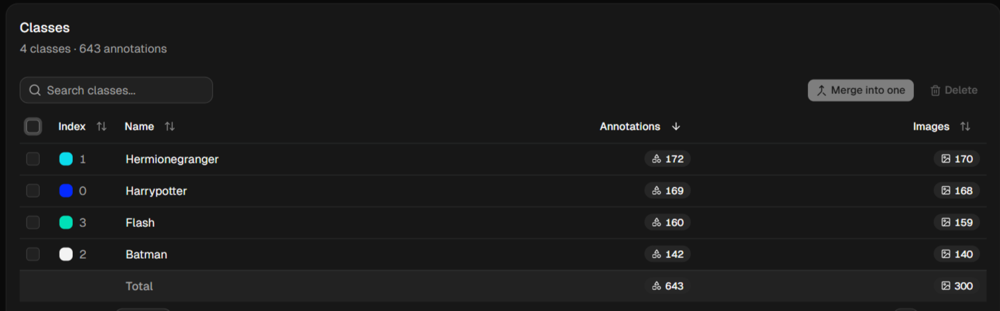
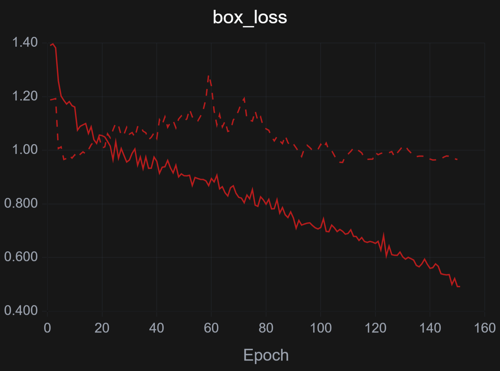
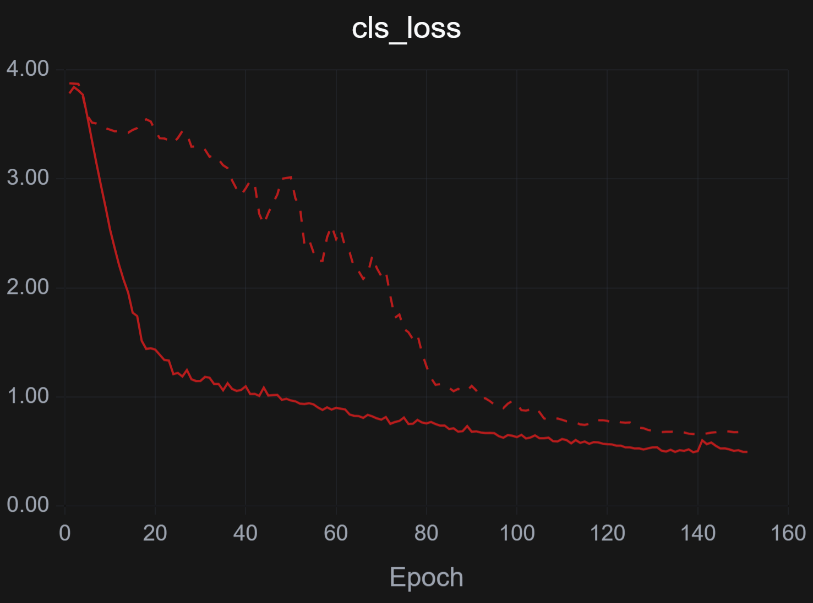
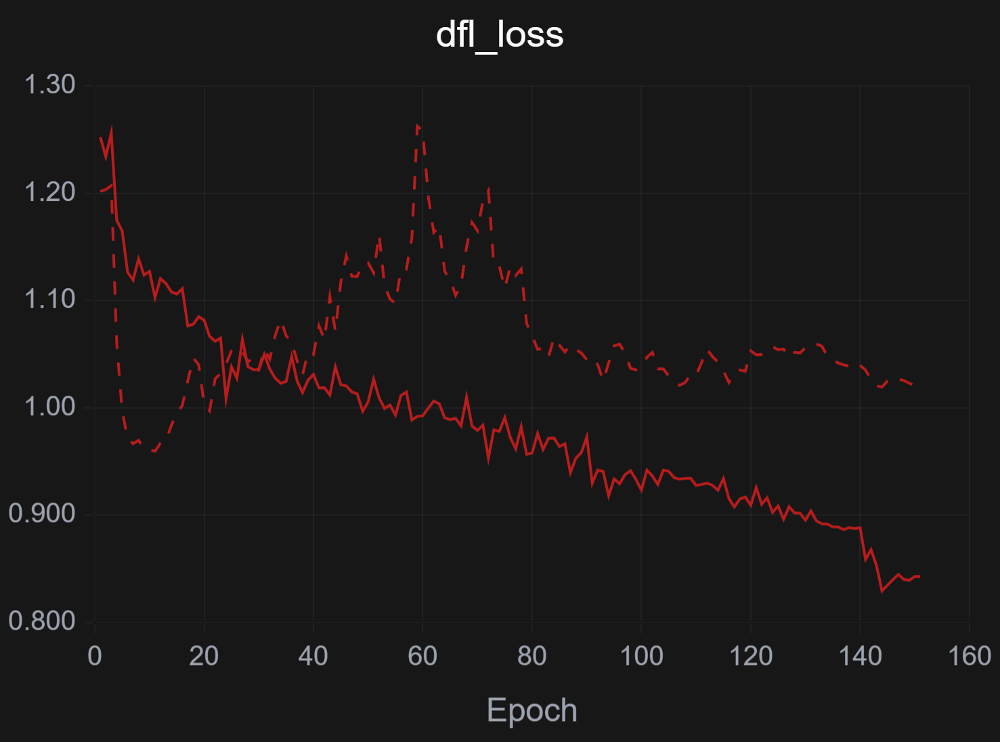
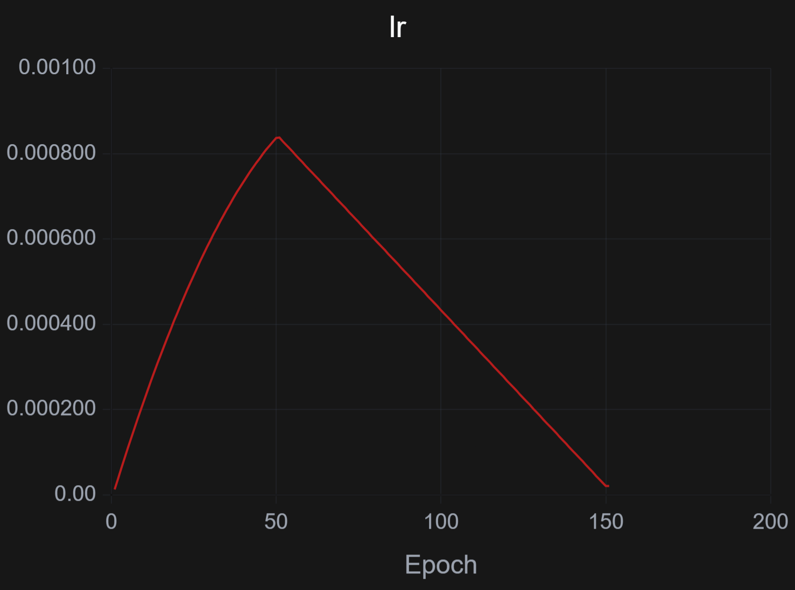
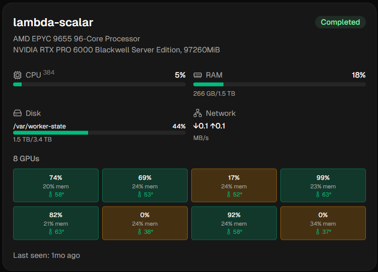

# Phygital Interaction

<p align="center">
  
</p>

An Android application that uses **AI-powered object detection** to identify Kinder Joy toys in real time through a smartphone camera.

The project focuses on building a reliable on-device detection system using a custom-trained YOLO model and ONNX Runtime.

Simply point the camera at a supported Kinder Joy toy, and the application detects and identifies it.

---

# 📱 How It Works

```text
Physical Kinder Joy Toy
          ↓
      Camera Input
          ↓
    Image Processing
          ↓
     YOLO AI Model
          ↓
    Object Detection
          ↓
 Confidence Validation
          ↓
     Toy Identified
```

The application continuously processes camera frames and checks whether a trained Kinder Joy toy is present.

The user does not need to manually select the toy. The application uses the camera and trained AI model to recognize it.

---

# ✨ Features

- 📷 Real-time camera detection
- 🤖 Custom-trained YOLO object detection model
- ⚡ ONNX Runtime inference on Android
- 🎯 Confidence-based detection filtering
- 🔲 Real-time bounding box detection
- 🧸 Multiple Kinder Joy toy classes
- 📱 Camera orientation handling
- ⚙️ On-device AI inference
- 📦 Optimized ONNX model support

---

# 🏗️ System Architecture

The application processes camera frames through the following pipeline:

```text id="x4a6p4"
Android Camera
      ↓
CameraX
      ↓
Image Preprocessing
      ↓
YOLO ONNX Model
      ↓
ONNX Runtime
      ↓
Detection Output
      ↓
Confidence Filtering
      ↓
Non-Maximum Suppression
      ↓
Bounding Box Mapping
      ↓
Toy Confirmed
      ↓
Tells The Name of The Toy
```

The model identify **what the toy is** in the camera frame.

---

# 🤖 AI Model

The project uses a custom-trained YOLO object detection model.

For each detected object, the model returns:

- **Class name**
- **Confidence score**
- **Bounding box coordinates**

Example:

```text
Detected: Kinder Joy Toy

Confidence: 92%

Bounding Box:
X1: 120
Y1: 240
X2: 420
Y2: 640
```

The application filters low-confidence detections to reduce incorrect results.

---

# 📦 Model Export Comparison

Different ONNX export versions were tested to understand the trade-off between **model size, performance, compatibility, and detection quality**.

<p align="center">
  
</p>

---

# 📊 Dataset Analysis

Before training, the dataset was analyzed to better understand the images, annotations, classes, and object distribution.

---

## Class Distribution

This shows how the training data is distributed between the different toy classes.

<p align="center">
  
</p>

---

## Classes

The dataset contains multiple toy classes used for object detection.

<p align="center">
  
</p>

---

## Top Classes

This visualization shows the most represented classes in the dataset.

<p align="center">
  
</p>

---

## Split Distribution

This shows how the dataset is distributed across the different dataset splits.

<p align="center">
  
</p>

---

## Image Dimensions

The dataset contains images with different dimensions and aspect ratios.

<p align="center">
  
</p>

<p align="center">
  
</p>

---

## Image File Size

This visualization shows the distribution of image file sizes.

<p align="center">
  
</p>

---

## Image Formats

This shows the image formats used in the dataset.

<p align="center">
  
</p>

---

## Annotation Locations

This visualization shows where objects are located throughout the training images.

<p align="center">
  
</p>

---

## Bounding Box Dimensions

The following analysis shows the distribution of bounding box sizes.

<p align="center">
  
</p>

---

## Bounding Box Dimensions — Additional Analysis

An additional bounding-box analysis is provided below.

<p align="center">
  
</p>

---

## Objects Per Image

This graph shows how many annotated objects are present in each image.

<p align="center">
  
</p>

---

# 🧠 Training Analysis

The following images show the model training behaviour and optimization process.

---

## Box Loss

Box loss measures the model's bounding-box localization error during training.

<p align="center">
  
</p>

---

## Classification Loss

Classification loss measures how well the model learns to distinguish between different toy classes.

<p align="center">
  
</p>

---

## DFL Loss

Distribution Focal Loss helps improve bounding-box localization.

<p align="center">
  
</p>

---

## Learning Rate

The learning-rate progression during training is shown below.

<p align="center">
  
</p>

---

# 📈 Model Performance

The trained model was evaluated using standard object-detection metrics.

---

## mAP@50

This measures detection accuracy at an IoU threshold of 0.50.

<p align="center">
  
</p>

---

## mAP@50–95

This is a stricter evaluation across multiple IoU thresholds.

<p align="center">
  
</p>

---

## Precision

Precision shows how many detected objects are actually correct.

<p align="center">
  
</p>

---

## Recall

Recall shows how successfully the model detects objects that are actually present.

<p align="center">
  
</p>

---

# 🎯 Confidence Analysis

Every prediction produced by the AI model has a confidence score.

For example:

```text
0.95 → Very confident
0.80 → Strong detection
0.60 → Possible detection
0.30 → Low confidence
````

Choosing the correct confidence threshold is important for avoiding false detections while still detecting the toy reliably.

---

## F1-Confidence Curve

The F1 score helps find a balance between precision and recall at different confidence thresholds.

<p align="center">
  
</p>

---

## Precision-Confidence Curve

This shows how precision changes with different confidence thresholds.

<p align="center">
  
</p>

---

## Recall-Confidence Curve

This shows how recall changes with different confidence thresholds.

<p align="center">
  
</p>

---

## Precision–Recall Curve

This shows the relationship between precision and recall across different confidence levels.

<p align="center">
  
</p>

---

# 🔍 Confusion Matrix

The confusion matrix shows how well the model distinguishes between the different toy classes.

<p align="center">
  
</p>

---

## Normalized Confusion Matrix

The normalized version makes it easier to compare the detection accuracy of each class.

<p align="center">
  
</p>

---

# 💻 System Performance

The following images show resource usage and system behaviour during the experiment.

---

## CPU & RAM Usage

<p align="center">
  
</p>

---

## GPU Utilization & Memory

<p align="center">
  
</p>

---

## GPU Temperature

<p align="center">
  
</p>

---

## Disk I/O

<p align="center">
  
</p>

---

## Network I/O

<p align="center">
  
</p>

---

## Run Information

<p align="center">
  
</p>

---

## System Information

<p align="center">
  
</p>
```

# 📐 Handling Camera and Model Coordinates

One important part of the project is mapping the model output back to the Android camera preview.

The AI model may process an image at:

```text id="cbvrl9"
320 × 320
```

while the Android camera preview could be:

```text id="q7ue82"
1080 × 1920
```

Because of this difference, bounding box coordinates cannot simply be displayed directly.

The application handles:

- Image resizing
- Aspect ratio differences
- Camera rotation
- Portrait orientation
- Landscape orientation
- Model-to-screen coordinate conversion

The final goal is to ensure that the bounding box appears over the correct physical object on the screen.

---

# 🛠️ Technology Stack

| Technology | Purpose |
|---|---|
| **Android** | Mobile application platform |
| **Kotlin** | Application development |
| **CameraX** | Camera frame processing |
| **YOLO** | Object detection |
| **ONNX** | Model format |
| **ONNX Runtime** | Running the AI model on-device |

---

# 🔄 Complete Detection Flow

The complete process inside the application looks like this:

```text id="q8o1c2"
1. User opens the application
            ↓
2. Camera starts
            ↓
3. CameraX provides image frames
            ↓
4. Frame is rotated if required
            ↓
5. Image is resized for the AI model
            ↓
6. Pixel data is converted to model input
            ↓
7. ONNX Runtime runs inference
            ↓
8. YOLO predictions are processed
            ↓
9. Low-confidence predictions are removed
            ↓
10. Non-Maximum Suppression removes duplicates
            ↓
11. Bounding box is mapped to the screen
            ↓
12. Toy is identified
```

---

# 📱 Orientation Support

The project is designed to handle both:

```text id="h76c5n"
📱 Portrait Mode
```

and:

```text id="ljn9h3"
📱 Landscape Mode
```

Camera orientation is especially important because the AI model input and Android preview can have different dimensions and rotations.

Correct coordinate mapping is required to ensure that the detected object's bounding box remains aligned with the physical toy.

---

# 🚀 Getting Started

## Clone the repository

```bash id="6m9i6u"
git clone https://github.com/Karthi-1008/Phygital_Interaction.git
```

## Open the project

Open the project in **Android Studio**.

## Add the AI Model

Place the ONNX model inside the application assets directory.

Example:

```text id="n4j1l7"
app/
└── src/
    └── main/
        └── assets/
            └── model.onnx
```

## Run the Application

1. Connect an Android device.
2. Enable Developer Options.
3. Enable USB Debugging.
4. Open the project in Android Studio.
5. Select the connected device.
6. Build and run the application.

---

# 🔮 Future Improvements

This project is still being developed and improved.

Planned improvements include:

- [ ] Optimize model size
- [ ] Improve INT8 model compatibility
- [ ] Add more Kinder Joy toy classes
- [ ] Stabilize detections across multiple frames
- [ ] Add object tracking
- [ ] Attach digital content to detected physical objects
- [ ] Improve detection at different camera angles
- [ ] Improve portrait and landscape consistency
- [ ] Reduce inference time
- [ ] Reduce false positives
- [ ] Improve confidence threshold selection

---

# 🎁 The Main Idea

The goal of this project is to build a reliable and efficient **real-time toy detection system for Android**.

The project combines:

```text
Smartphone Camera
        +
Computer Vision
        +
Custom YOLO Model
        +
ONNX Runtime
        =
Real-Time Toy Detection
```

The focus is on making object detection accurate, fast, and practical for running directly on a mobile device.

This project combines **computer vision, mobile development, artificial intelligence** to explore that idea.

---

# 📂 Repository

[Phygital Interaction on GitHub](https://github.com/Karthi-1008/Phygital_Interaction.git)

Also On Hugging Face and Kaggle for Dataset

[karthi1008/Phygital_Interaction](https://huggingface.co/datasets/karthi1008/Phygital_Interaction)

https://www.kaggle.com/datasets/karthikeyan100/kinder-joy-toys
---

## 👨‍💻 Author

**Karthikeyan A**

---

⭐ If you find this project interesting, feel free to star the repository.
